# スライドのコピー

:::: columns
::: {.column width="55%"}
 

bit.ly/123haru

{width=90%}

:::

::: {.column width="45%"}

紙の資料は教室の入口付近にあります。

 

左のQRコードを読み取るか，
上のURLを開くと  
スライドをブラウザーで閲覧、もしくは、
PDFファイルをダウンロードすることが可能です。

:::
::::

<!-- もくじ -------------------------------------------------{{{ -->
# もくじ
 

1. シュンペーター的経済成長
2. 見かけの大木仮説
3. 政策
4. 結論
<!--- }}} --->

# シュンペーター的経済成長

<!-- 背景説明 -----------------------------------------------{{{ -->
## 背景説明
- "A Model of Growth through Creative Destruction", 

  （創造的破壊による経済成長）

  P. Aghion and P. Howitt, 1992, *Econometrica*
  - ５年間、"they were killing me"
- 2025年ノーベル経済学賞
  - Philippe Aghion, Peter Howitt, Joel Mokyr 
  - "innovation-driven economic growth"
- 博士論文（Oxford）の指導教員がAghion先生
- 「Grossman and Helpmanは？」と思ってる人に

:::notes
- Econometrica = life-changing journal
- Aghion = エネルギッシュ、ノーベル賞講義でも動き回る、非常に熱心
- 「この世に天才はいない」
- Grossman and Helpmanは？
  - 平たく言えば「コピーキャット」
- Romer (1990) 「最初読んでも理解できなかった」
:::
<!-- }}} -->

<!-- シュンペーター的経済成長とは ---------------------------{{{ -->
## シュンペーター的経済成長とは
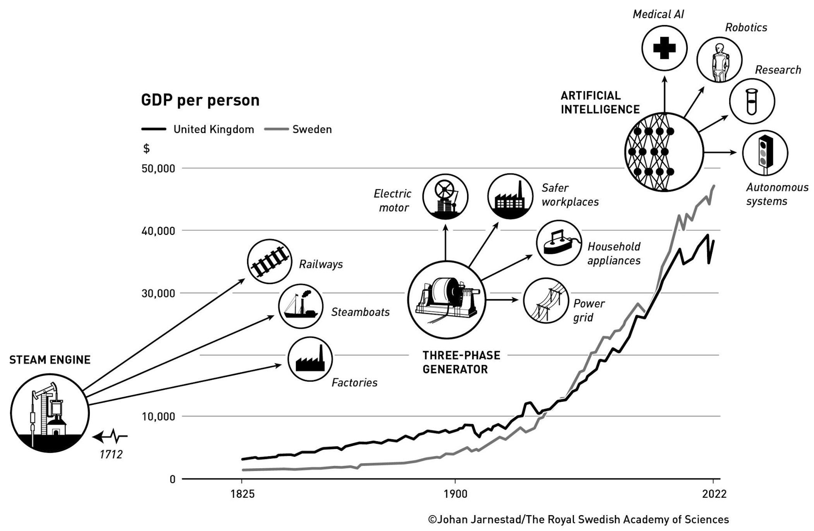{width=70% fig-align="center"}

出典：2025年ノーベル経済学賞プレスリリース
<!-- }}} -->

<!-- Aghion and Howitt (1992)の貢献（１） -------------------------{{{ -->
## Aghion and Howitt (1992)の貢献（１） {.small-body}
- ヨーゼフ・シュンペーター：**創造的破壊**
  - 新たなイノベーションは既存のイノベーションを陳腐化
- 創造的破壊による経済成長を理論モデル化に成功
  - 創造的破壊のインセンティブ構造を明らかにした  
  （Romer (1990)にはない）
- アイデア
  - 累積的なイノベーションによりGDPは長期的に成長する
  - 将来の利潤を獲得しようとする企業家がイノベーションを発生させる
  - 創造的破壊
<!-- }}} -->

<!-- Aghion and Howitt (1992)の貢献（２） -------------------------{{{ -->
## Aghion and Howitt (1992)の貢献（２）  {.small-body}
:::: columns
::: {.column width="65%"}
技術水準のはしご

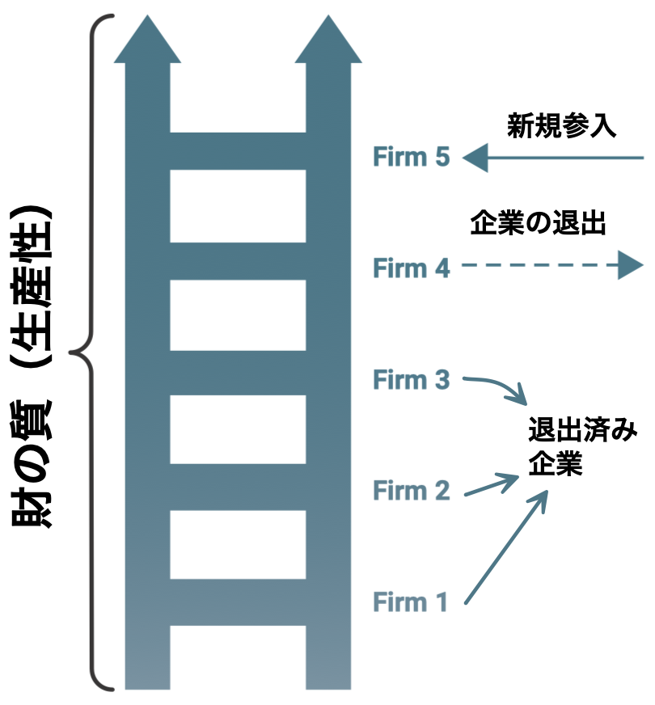{width=70% fig-align="center"}
:::
::: {.column width="35%"}
- 様々なバージョンがあり、既存企業が共存するモデルもある
- 先端技術のフロンティアまでの    
  「距離」という概念に基づくモデル

出典：The Middle-Income Trap, 2024, the World Bank
:::
::::

<!-- }}} -->

<!-- 創造的破壊の例：音楽 -------------------------{{{ -->
## 創造的破壊の例：音楽
 

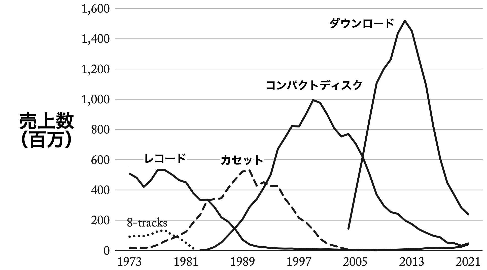{width=80% fig-align="center"}

出典：Creative Destruction, 2024, Cato Institute

<!-- }}} -->

<!-- 創造的破壊と経済成長 -------------------------{{{ -->
## 創造的破壊と経済成長
 

:::: columns
::: {.column width="70%"}
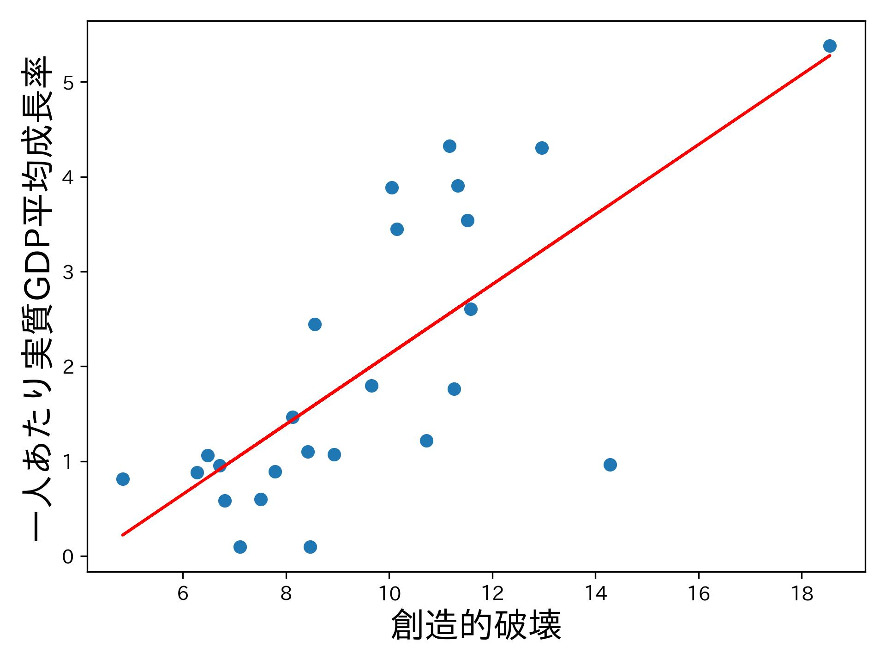{width=100% fig-align="center"}
:::
::: {.column width="30%"}
- 2011〜2019年
- 欧州25カ国
- 横軸：

  企業参入率と退出率の平均
- データ：Eurostat
:::
::::
<!-- }}} -->

<!-- 創造的破壊：広い応用性 ---------------------------------{{{ -->
## 創造的破壊：広い応用力
- 競争とイノベーション
- 国際貿易
- 不平等
- 経済成長における労働市場の役割
- 環境問題と気候変動
- 経済発展
- 政治経済学
- 産業ダイナミックス
- etc
<!-- }}} -->

<!-- 競争：利潤とイノベーションの関係 -----------------------------{{{ -->
## 競争：利潤とイノベーションの関係
- 企業は利潤を得るためにR\&D投資
  - 利潤$\uparrow$ $\Rightarrow$ R\&D投資$\uparrow$ $\Rightarrow$ イノベーション$\uparrow$ 
- 競合する企業数$N$が増える場合（新規参入）
  - $N\uparrow$ $\Rightarrow$ **今の利潤**$\downarrow$
    $\Rightarrow$ R\&D投資$\downarrow$
  - $N\uparrow$ $\Rightarrow$ **今の利潤**$\downarrow$
    $\Rightarrow$ R\&D投資$\color{red}{\boldsymbol\uparrow}$

    $\because$ **将来の利潤**$\uparrow$のために（マラソン）
- 含意
  - 適度な競争は必要
  - 今の利潤**小**＋将来の利潤**大**
    $\Rightarrow$ R\&Dインセンティブ**大**

:::notes
- 自分と後ろのランナーの距離＝利潤
:::
<!-- }}} -->

<!-- 競争：既存企業の二つの戦略 ---------------------------------{{{ -->
## 競争：既存企業の二つの戦略
- 利潤を得ている既存企業を考えよう
- 将来の利潤を得るための二つの戦略
  - 戦略A：R\&D投資（正攻法）
  - 戦略B：参入の阻止（邪道、裏技）
- 既存企業はイノベーションを推進／抑制する
- 戦略Bの弊害
  - イノベーションは発生しない $\Rightarrow$ 資源の社会的損失
  - ロビー活動など $\Rightarrow$ 政策の歪み
  - カルテル $\Rightarrow$ 厚生の損失
<!-- }}} -->

<!-- 発展経済：中所得の罠 ---------------------------{{{ -->
## 発展経済：中所得の罠  {.small-body}
- The Middle-Income Trap, 2024, the World Bank
  - 中所得国：US名目GNIの$1.5\% \sim 18\%$

    （名目GNI＝名目GDP＋海外からの所得の純受取）

:::: columns
::: {.column width="43%"}
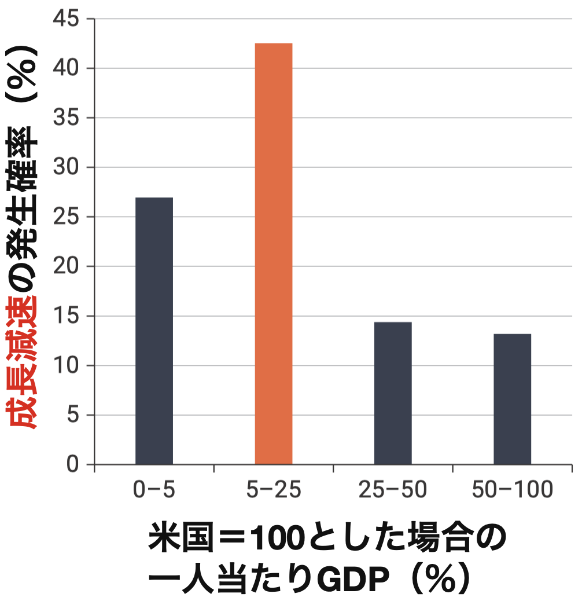{width=90% fig-align="center"}
:::
::: {.column width="57%"}
- 1972〜2010年、69カ国

- Slowdown = 統計学的に成長率に負の構造変化が発生

- 縦軸 = 各階級である国がある年にSlowdownに該当する割合
:::
::::
<!-- }}} -->

<!-- 発展経済：言及されている事例 ---------------------------{{{ -->
## 発展経済：言及されている事例
- ミツバ（日本の自動車分品メーカー）
  - 2013年の米独占禁止法違反（カルテル） $\Rightarrow$ 参入抑制
- インドの制度License Raj
  - 1951年〜1990年代に参入・生産規制 $\Rightarrow$ 起業活動抑制
- イタリアの地元小売市場の既存企業
  - 2000年代、地方政府に働きかけ $\Rightarrow$ 参入規制
- Tyco Electronics（多国籍企業）
  - 1995–2004年、光ファイバー規格標準化 $\Rightarrow$ 市場支配
- キラー買収 $\Rightarrow$ 参入の芽を摘む
<!-- }}} -->

<!-- 産業ダイナミックス：イタリア(１) ---------------------------{{{ -->
## 産業ダイナミックス：イタリア（１）{.nostretch}
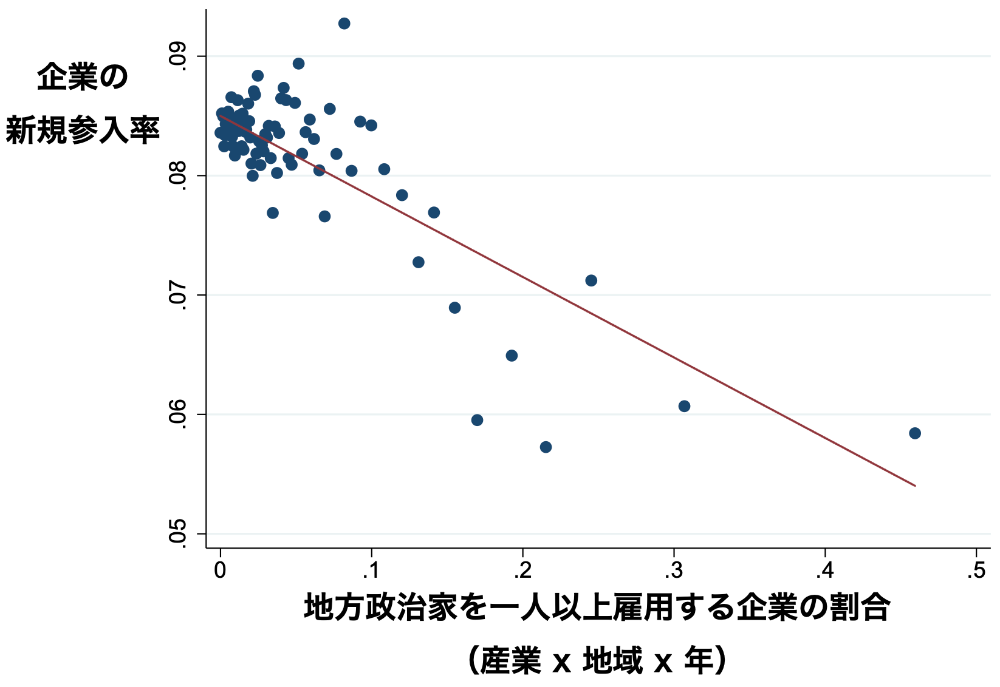{fig-align="center" style="width:80%; display:block; margin:auto;"}
出典：Connecting to Power: Political Connections, Innovation, and Firm Dynamics, Akcigit et. al, 2018, NBER No25136
<!-- }}} -->

<!-- 産業ダイナミックス：イタリア(２) ---------------------------{{{ -->
## 産業ダイナミックス：イタリア（２）{.nostretch}
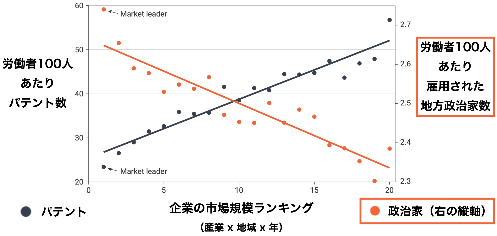{fig-align="center" style="width:80%; display:block; margin:auto;"}
出典：Connecting to Power: Political Connections, Innovation, and Firm Dynamics, Akcigit et. al, 2023, *Econometrica*
<!-- }}} -->

# 見かけの大木仮説

<!-- 「見かけ」の意味 ---------------------------{{{ -->
## 「見かけ」の意味
 

:::: columns
::: {.column width="40%"}
「見かけの位置」とは

- 観測者の目にそう見えている位置（$A^{\prime}$）であって，実際にオレンジの物体がある位置（$A$）とは異なる

:::
::: {.column width="60%"}
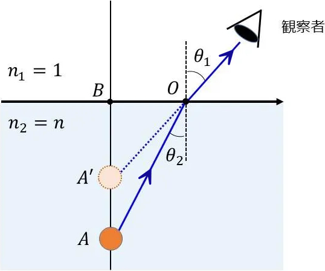{width=100% fig-align="center"}
:::
::::
<!-- }}} -->

<!-- 見かけの大木仮説 ---------------------------{{{ -->
## 見かけの大木仮説
::: {.box}
シュンペーター的成長理論に基づき、

日本の失われた30年を再解釈する
:::

:::: columns
::: {.column width="62%"}
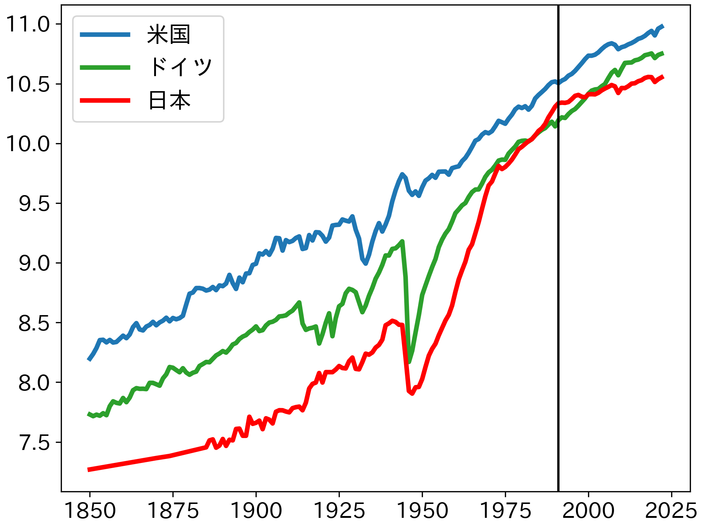{width=95% fig-align="center"}
:::
::: {.column width="38%"}
- 一人あたりGDP（対数）
- 黒の縦線：1991年
- ある期間のトレンドの傾き＝平均成長率
- Maddison Project Database 2020
:::
::::
<!-- }}} -->

<!-- 失われた30年：特徴１ ---------------------------{{{ -->
## 失われた30年：特徴１

|   期間 |   平均成長率 | 一人当たりGDPが2倍に なるために 必要な期間 |
|:------------:|:-----:|--------:|
| 1946〜1971年 | 7.27% |  9.88年 |
| 1971〜1991年 | 3.33% | 21.13年 |
| 1991〜2022年 | 0.70% | 99.52年 |

 

データ：Maddison Project Database 2020

Penn World Table 11.0（1950〜）を使っても概ね同じような結果

<!-- }}} -->

<!-- 失われた30年：特徴２ ---------------------------{{{ -->
## 失われた30年：特徴２  {.small-body}

:::: columns
::: {.column width="62%"}
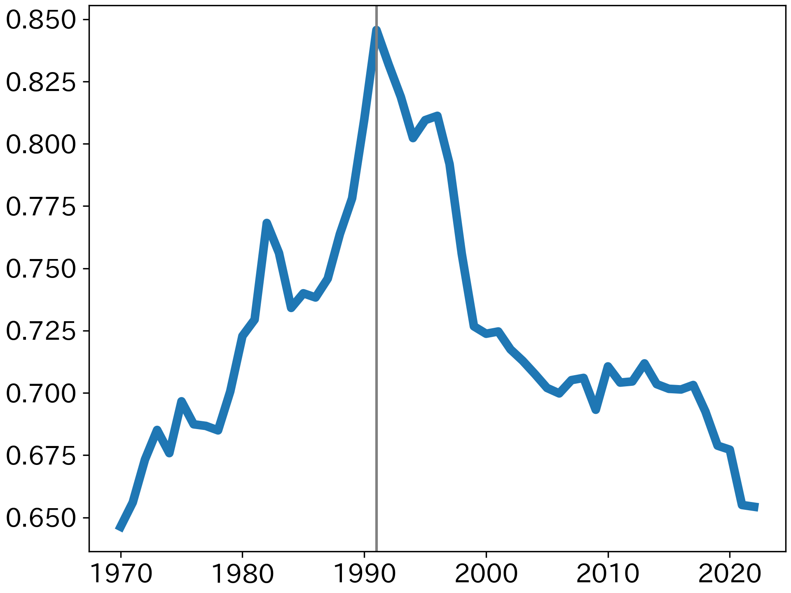{width=95% fig-align="center"}
:::
::: {.column width="38%"}
- 縦軸$=\dfrac{\text{一人当たりGDP}_{日本}}{\text{一人当たりGDP}_{米国}}$
- 黒の縦線：1991年
- 米国への
  - 接近（1991年まで）
  - 後退（1991年後）
- 今は1970年代の  
  水準に後戻り
:::
::::

Penn World Table 11.0を使っても概ね同じような結果
<!-- }}} -->

<!-- 失われた30年：特徴３ ---------------------------{{{ -->
## 失われた30年：特徴３
 

世界のGDPに対して日本のGDPが占める割合（％）

:::: columns
::: {.column width="50%"}
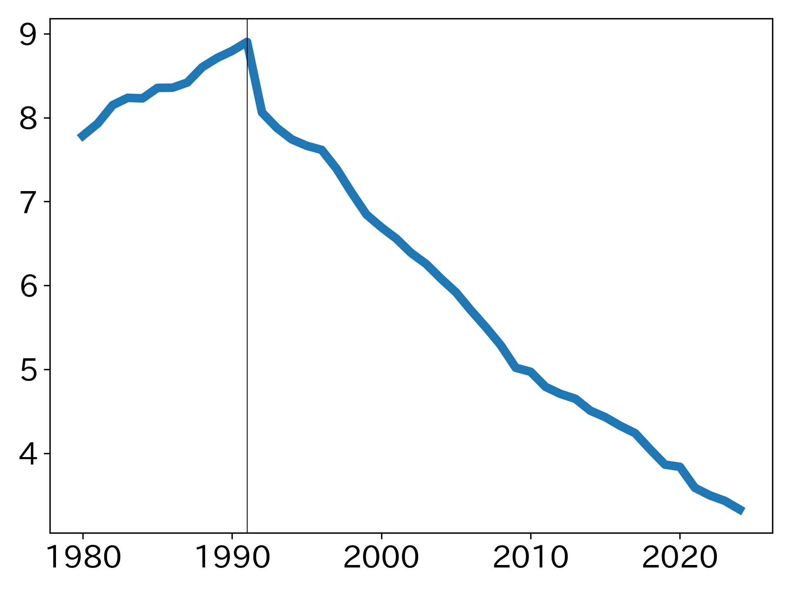{width=95% fig-align="center"}
:::
::: {.column width="50%"}
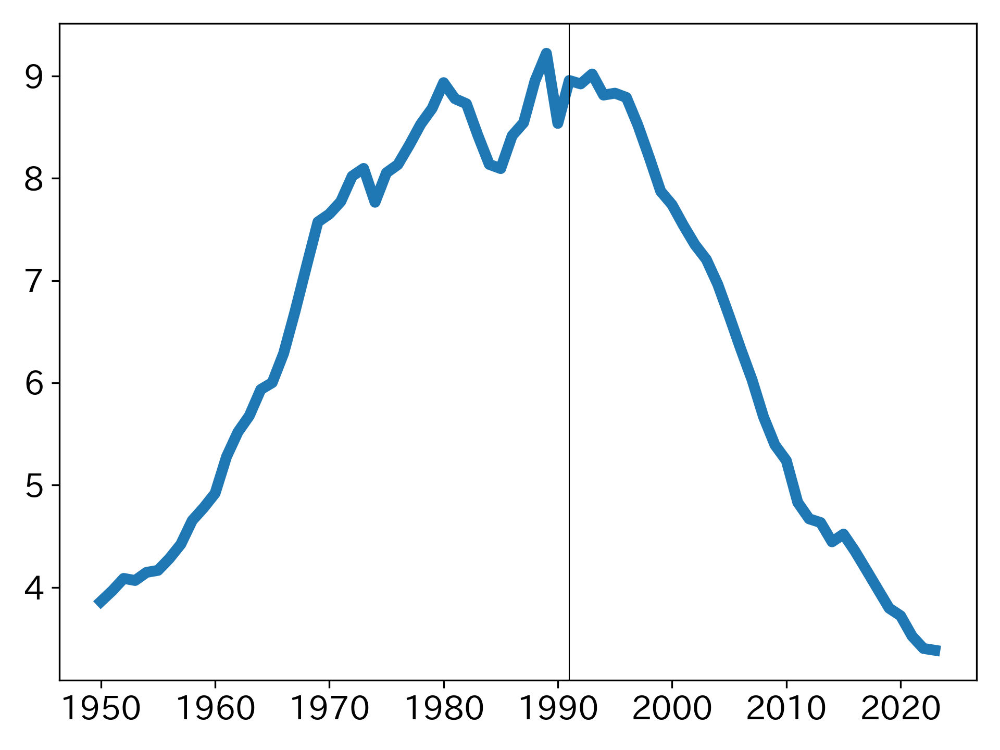{width=95% fig-align="center"}
:::
::::
<!-- }}} -->

<!-- 考えられる主な理由 ---------------------------{{{ -->
## 考えられる主な理由 {.small-body-2}
- バランスシート不況
  - 資産価格急落 → 民間部門の貯蓄超過 → 総需要不足
- 金融システムの機能不全（不良債権問題）
  - ゾンビ企業🧟‍♂️
    - 銀行が不良債権処理を先送り → 生産性の低い企業を延命
- TFP成長率（技術進歩率）の構造的低下
  - 産業間再配分の鈍化、創造的破壊率の低下、内部留保
- デフレスパイラルと金融政策の限界
  - デフレ → 実質金利の高止まり（流動性の罠）
- 人口動態の悪化（少子高齢化）
- 企業ガバナンスの失敗
<!-- }}} -->

<!-- 二つのポイント ---------------------------{{{ -->
## 二つのポイント  {.small-body}
- 独立した要因ではない
  - バランスシート悪化 → ゾンビ企業🧟‍♂️増加 → TFP低下

    → デフレ圧力 → 実質金利上昇
- 年代によって重要性は異なる
  - 1990年代：金融危機型停滞
    - バランスシート不況、ゾンビ企業🧟‍♂️、金融政策、
  - 2000年代以降：構造型停滞
    - 人口高齢化、企業ガバナンス、金融政策、

      低い創造的破壊率

<!-- }}} -->

<!-- 見かけの大木仮説 ---------------------------{{{ -->
## 見かけの大木仮説

 

外形的な繁栄や安定が維持されている一方で、イノベーション環境の変化に対応する適応力が徐々に低下し、創造的破壊への転換が困難になった制度を指す仮説

 
 

既存の説明との違い

- 見かけの大木仮説：    
  日本の高度成長期から現在までの期間を対象
- 他の説明はバブル崩壊後の説明

:::notes
- 既存の説明はバブル崩壊後の期間
- この仮説は戦後の高度成長期を含めて考察
:::
<!-- }}} -->

<!-- この報告の構造：事件になぞらえる ---------------------------{{{ -->
## この報告の構造：事件になぞらえる {.small-table}
 

<table class="fixed-table">
  <colgroup>
    <col style="width: 18%;">
    <col style="width: 47%;">
    <col style="width: 35%;">
  </colgroup>
  <thead>
    <tr>
      <th></th>
      <th>この報告（経済研究）</th>
      <th>事件の捜査</th>
    </tr>
  </thead>
  <tbody>
    <tr>
      <td>起きたこと</td>
      <td>失われた30年</td>
      <td>殺人事件</td>
    </tr>
    <tr>
      <td>被害</td>
      <td>成長率の停滞</td>
      <td>Aさん死亡</td>
    </tr>
    <tr>
      <td>原因候補</td>
      <td>バランスシート不況など</td>
      <td>複数の容疑者</td>
    </tr>
    <tr>
      <td>状況証拠</td>
      <td>データ・制度変化・歴史的事実</td>
      <td>アリバイ・動機・証言</td>
    </tr>
    <tr>
      <td>仮説</td>
      <td>資産価格↓ → 需要不足など 
          見かけの大木仮説</td>
      <td>犯行シナリオ</td>
    </tr>
    <tr>
      <td>検証</td>
      <td>理論とデータで説明できるか</td>
      <td>証拠と矛盾しないか</td>
    </tr>
    <tr>
      <td>目的</td>
      <td>停滞メカニズムの理解</td>
      <td>犯人特定</td>
    </tr>
  </tbody>
</table>

<!-- }}} -->

<!-- 鉄のトライアングル ---------------------------{{{ -->
## 鉄のトライアングル（55年体制を支えた）  {.small-body-2}

:::: columns
::: {.column width="60%"}

 

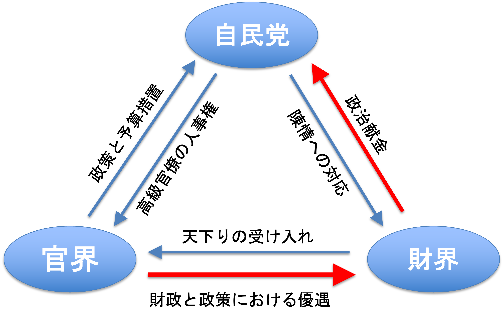{width=100% fig-align="center"}

出典：『戦後日本の経済と社会』, 石原享一, 2015, 岩波書店
:::
::: {.column width="40%"}
- 経済成長の

  
  黄金のトライアングル
  

- 日本が大木へ育つ中心的メカニズム
- 利点：安定性

  強いインセンティブ
- 問題：安定性

  強いインセンティブ
  - 見かけの大木を育てた
- レントシーキング活動を促進（赤い矢印）
:::
::::

:::notes
企業などが政治家や官僚に働きかけ（ロビー活動など）、自社に有利な法律、規制、補助金などを導入させることで、生産活動を行わずに不当な利益（レント＝利権・超過利潤）を得ようとする行動
:::
<!-- }}} -->

<!-- レントシーキングとは ---------------------------{{{ -->
## レントシーキングとは
 

> 企業による（独占）レント獲得・維持のための活動をいう。他企業の参入を阻止する行動や，政府による参入規制または輸入制限政策を実施・温存させるための政治的活動等が典型的。これらの多くは社会的な資源の浪費である。
 

（経済辞典、有斐閣、第５版）
<!-- }}} -->

<!-- なぜ鉄のトライアングルは機能したのか？ ---------------------------{{{ -->
## なぜ鉄のトライアングルは機能したのか？ {.small-body-2}
- 技術フロンティアからの「距離」
  - Gerschenkron (1962), Acemoglu, Aghion and Zilibotti (2006, JEEA) 
  - 「遠い」＝ キャッチアップ段階
  - 既存技術の大量導入・改善で成長可能（例：自動車）
  - 既存の大企業は資金が潤沢
    $\rightarrow$ 信用制約を克服
    $\rightarrow$ 大規模投資が可能
    $\rightarrow$ 企業の選別は重要ではない
  - メインバンク制 → 長期資本配分
  - 非競争的な安定的な関係に基づく取り決めが最適
  - 情報の非対称性の軽減、大蔵省による護送船団方式の政策
  - 企業内創造的破壊
    $\rightarrow$ 長期雇用制度
- 強調の失敗の克服、幼稚産業保護、高貯蓄率 $\Rightarrow$ 資本蓄積、    
  教育 $\Rightarrow$ 人的蓄積

:::notes
後発性が利点
:::
<!-- }}} -->

<!-- 鉄のトライアングルの問題点 ---------------------------{{{ -->
## 鉄のトライアングルの問題点  {.small-body-2}
- トライアングルが結束しようとする強いインセンティブ

  $\Rightarrow$ 外性的ショックに耐える適応力の欠如
  - 既得権益を守るインセンティブの拡大（e.g. 農業）
  - 米国・英国のような市場原理に基づく構造改革なし
    - 小さな政府：大幅減税、規制緩和、労働市場改革など
  - 米国・英国：後に続くイノベーションの土壌を整理したと解釈可
    - ベンチャー資本の発展、M&Aの活発化、市場競争導入
    - 実証研究：競争は技術革新の促進
- ストレステスト $\Rightarrow$ 二つのショック
  - 1990–1992：資産価格バブル崩壊
  - 1997–1998：金融システム・ショック

    （e.g. 山一證券の破綻とガバナンス問題）
<!-- }}} -->
    
<!-- 鉄のトライアングル：インセンティブ（例） ---------------------------{{{ -->
## 鉄のトライアングル：インセンティブ（例） {.small-body}
- なぜ銀行はゾンビ企業🧟‍♂️を育てたか？
- 自己資本比率規制をクリアするための手法
    $\qquad\text{自己資本} = \text{総資産} - \text{負債}$
  - 含み損を確定しない（資産価格下落を帳簿に反映しない）
  - 不良債権を過小評価（回収不能貸出を正常資産として扱う）
  - 退出すべき企業に貸し出しゾンビ🧟‍♂️化させる

    （デフォルト認定を回避し損失確定を遅らせる）
- 官僚はそれを許容し、抜本的な政策を控えた

鉄のトライアングルを維持する強いインセンティブの結果
<!-- }}} -->

<!-- 何もしなかったわけではないが、、、 ---------------------------{{{ -->
## 何もしなかったわけではないが、、、  {.small-body}
- 経済政策
  - 電電公社民営化、国鉄分割民営化、金融自由化、  
    金融システム改革、郵政民営化、規制改革・市場開放、etc
- 政治家 x 官僚：内閣人事局による官僚人事の政治主導など
- 政治家 × 財界：政治資金規正法改正など
- 官僚 × 財界：天下り規制強化など
- 1993年の細川政権成立、しかし、    
  1994年以降自民党政権復帰

鉄のトライアングルの再編 → 存続

<!-- }}} -->

<!-- 日本：企業の参入率と退出率 ---------------------------{{{ -->
## 日本：企業の参入率と退出率 {.small-body-2}
:::: columns
::: {.column width="65%"}
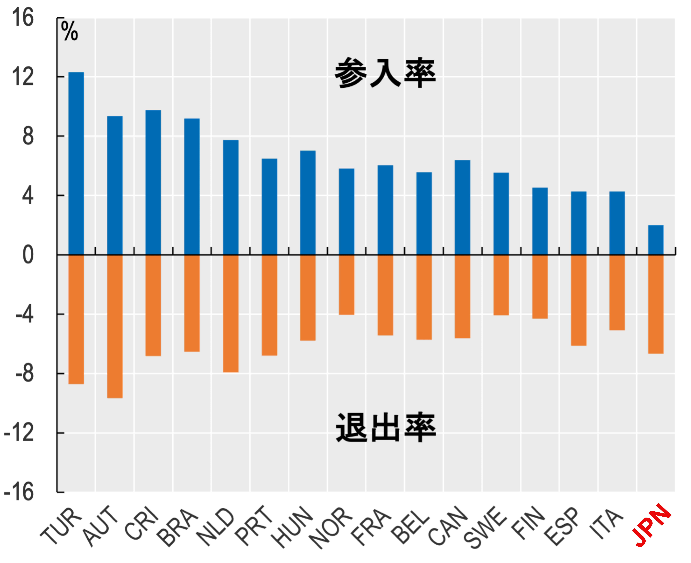{width=90% fig-align="center"}
:::
::: {.column width="35%"}
1998-2015年の平均

- $\dfrac{\text{参入率}}{\text{退出率}}$ （比率）
  - 日本：0.30
  - 平均(日本以外)：1.13
- 「破壊」はできたが「創造」ができていない
:::
::::

ゾンビ🧟‍♂️は自分の墓に戻ったが、街に人は戻らない状態

<!-- }}} -->

<!-- 参入企業：ベンチャー・キャピタル（VC） ---------------------------{{{ -->
## 参入企業：ベンチャー・キャピタル（VC） {.small-body-2}
 

VCから資金提供を受けた企業数（2018-19年）

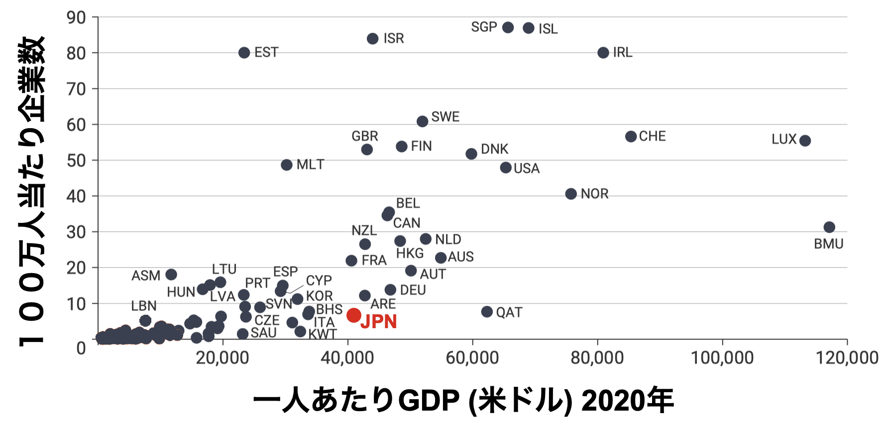{width=90% fig-align="center"}

:::notes
- ベンチャー・キャピタルの供給側と需要側
- 需要側の話
:::
<!-- }}} -->

<!-- 企業の参入費用の比較：1999年（85カ国） ---------------------------{{{ -->
## 企業の参入費用の比較：1999年（85カ国） { .small-table}
スタートアップが法的地位を取得するために必要な手続き

|                 | 日本      | 米国    | タイ  | 平均 |
|----------------:|----------:|--------:|------:|-----------:|
| 所要時間        | 26        | 4       | 35    | 47.4       |
| 費用            | 11.6%     | 0.5%    | 6.4%  | 47.1%      |
| 所要時間＋費用  | 22.0%     | 1.7%    | 20.4% | 66.0%      |
| 一人当たりGDP   | $32,230   | $30,600 | $8,490| $8,226     |

- 
  所要時間：営業日数（1週間＝5営業日、1ヶ月＝22営業日）
  
- 
  費用：一人当たりGDP比
  xxxxx● 所要時間＋費用：一人当たりGDP比
  

出典：Djankov et al. (2002, QJE)

:::notes
所要時間＋費用の「所要時間」＝日数x（一人当たりGDP/総営業日）
:::
<!-- }}} --> 

<!-- 鉄のトライアングルが機能しない理由 ---------------------------{{{ -->
## 鉄のトライアングルが機能しない理由  {.small-body-2}
- 技術フロンティアからの「距離」の議論を思い出そう
- 経済の技術水準と技術フロンティアとの「距離」によって最適な政策は異なる
  - 「遠い」：既存技術の大量導入・改善
    - 非競争的な安定的な関係に基づく長期投資
    - 鉄のトライアングルが適合
  - 「近い：イノベーションに基づく戦略
    - イノベーションを実行するうえで効率的な企業が必要
    - 市場メカニズムにる企業の選別   
      $\Rightarrow$
      
      より効率的な企業に入れ替わる創造的破壊が重要な役割
      
- 1990年代以降
  - 日本は技術のフロンティアにある
<!-- }}} -->

<!-- 見かけの大木仮説のまとめ ---------------------------{{{ -->
## 見かけの大木仮説のまとめ  {.small-body-2}
- バブル景気崩壊前
  - 技術フロンティア「遠い」
    $\Rightarrow$ 既存技術導入・改善
  - 鉄のトライアングル ＝ 成長の黄金のトライアングル
  - 企業内創造的破壊 $\Rightarrow$ 
    大木に育つ
    
  - 大木の内部では技術フロンティアに「近い」
    環境への  
    適応力は形成されなかった
- バブル景気崩壊後
  （失われた30年）
  - 技術フロンティアに「近い」
    $\Rightarrow$ イノベーション 
  - 鉄のトライアングルが仇となった
  - 外部ショック → 大木の内部の適応力の欠如が顕在化
  - 
    見かけの大木
    
    が露呈
<!-- }}} -->

# 政策

<!-- 政府の参入促進政策は？ ---------------------------{{{ -->
## スタートアップ政策は？  {.small-body-2}
- 2021年度開始の**Small/Startup Business Innovation Research**  
  制度のスタートアップ補助政策
  - 2024年度までの1700億円の内、採択の**２割が大企業**
  - 総務省「スタートアップ支援を目的としておらず、対象も限定していない」（日経2025.12.15）
  - 官僚 $\leftrightarrow$ 財界コネクション？
- スタートアップ育成５か年計画（2022〜2027年度）
  - 約1兆円規模の補助金を呼び水 → 2027年度
    に民間投資
    **10兆円**目標
  - {2022年：約9,459億円}、{2023年：約8,039億円}、  
    {2024年：約8,748億円}、{2025年上半期：3,399億円}  
  - 目標達成  
    2年以内に現状の**10倍以上**の民間投資額が必要
<!-- }}} -->

<!-- 創造的破壊、失業、リスクを取れる環境 ---------------------------{{{ -->
## 創造的破壊、失業、リスクを取れる環境  {.small-body}
- 企業の参入による創造的破壊 → 職の創出・破壊  
  → 労働者は失職
  - 失業者への対応
- フレキシキュリティ（flexicurity＝flexible＋security）
  - 次の特徴を組み合わせたデンマークの労働市場政策
  1. 企業に対する柔軟な雇用・解雇ルール
  2. 労働者に対する高水準の所得保障
  3. 労働者の再就職を支援する積極的労働市場政策
- 起業家の失敗 → 失職
  - リスクを取れる環境の整理が必要
<!-- }}} -->

# 結論

<!-- 非収束の罠 ---------------------------{{{ -->
## 非収束の罠  {.small-body-2}
- Acemoglu, Aghion and Zilibotti (2006, JEEA) 
- 非収束の罠
  - 既存技術の大量導入政策を続けすぎると、技術のフロンティアに収束できなくなる

> 韓国と日本の経験もまた、この議論と整合的である。戦後の長期にわたり、韓国と日本はともに、大規模な投資・大規模コングロマリット・政府補助金・比較的保護された国内市場に依存することで、急速な成長とフロンティアへの収束を達成した。収束と成長は、日本では1980年代半ばに終焉を迎えた……（p.41、脚注2の翻訳）

<!-- }}} -->

<!-- 日本経済に必要なこと ---------------------------{{{ -->
## 日本経済に必要なこと  {.small-body}
- 非収束の罠からの離脱（cf.「失われた30年：特徴２」）
- ①参入企業による創造的破壊と  
  ②企業内創造的破壊の  
  両輪によるイノベーション主導の経済成長
- ①には効率的な市場メカニズムが必須
- レントシーキング活動自体を禁止（企業献金）
  - 1994年から企業・団体献金と政党交付金が共存
- レントシーキングを促進する制度は有害

鉄のトライアングル自体の創造的破壊が必要
<!-- }}} -->

<!-- ありがとう ----------------------------------------{{{ -->
## { .final-slide }

::: {.final-content}
22年間ありがとうございました。

:::
<!-- }}} -->

